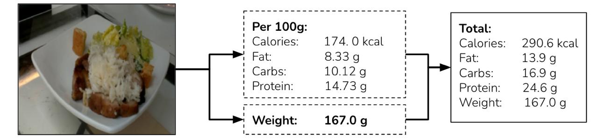

# FoodCNN

Zero-shot nutrition estimation from a single food photo.  
Deep learning models to predict dish weight, calories, and macronutrients (fat, carbs, protein) using the Nutrition5K dataset.  

Authors: Georgy Salakhutdinov, Georgii Kuznetsov, Ayoub Agouzoul  
École Polytechnique (X), 2025
- [Slides (PDF)](Slides.pdf) – project presentation
- [Report (PDF)](report/FoodCNN_Report.pdf) – full technical report

## Abstract

<p align="justify">
Keeping track of our food intake can still feel like a chore, even with so many nutrition apps available today. This project explores a potential solution through Machine Learning. We frame this challenge as a multi-output regression task. Given an RGB image of a plated dish, we want to predict its total weight together with calories, fat, carbs, and protein. The Nutrition5K dataset from Google Research has been utilized for training. This paper makes 3 contributions. Firstly, we present our data pipeline, which involves cleaning, segmentation, and a Principal Component Analysis (PCA) video frame extraction strategy. Secondly, we present our model WeightCNN that has been trained to predict weight with 18.7% relative MAE. Finally, we present a family of relative-macro models that have been trained to estimate macro percentages. The best relative model, achieving 24% realtive MAE, is then combined with WeightCNN to obtain the full calories and macronutrient prediction from a single photo.
</p>

## Example Output



*From a single dish photo, FoodCNN predicts the dish weight and macronutrient composition per 100g, then combines them to obtain the total calories and nutrients.*

## Usage

To run a prediction on a single dish image, use:
```
python predict_nutrition.py --image lunch_photo.jpg
```

## Citation

``` bibtex
@misc{kuznetsov_agouzoul_salakhutdinov2025foodcnn,
  title        = {FoodCNN: Zero-shot nutrition estimation from a single food photo},
  author       = {Kuznetsov, Georgii and Agouzoul, Ayoub and Salakhutdinov, Georgy},
  year         = {2025},
  institution  = {École Polytechnique (X)},
  howpublished = {https://github.com/FoodCNN/FoodCNN},
  note         = {MIT},
  abstract     = {Given a single photo of a plated dish, FoodCNN predicts dish weight, calories,
                  fat, carbs, and protein. Trained using the Nutrition5K dataset.}
}
```
